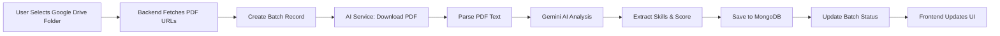

<div align="center">

# AI-Powered HR Platform

### Revolutionize Your Hiring Process with Intelligent Resume Screening & Payroll Management

[](https://nextjs.org/)
[](https://fastapi.tiangolo.com/)
[](https://nodejs.org/)
[](https://www.mongodb.com/)
[](https://ai.google.dev/)

[Features](#features) •
[Architecture](#architecture) •
[Quick Start](#quick-start) •
[Documentation](#documentation) •
[Contributing](#contributing)

</div>

---

## Overview

A comprehensive **AI-powered HR management platform** that streamlines recruitment, candidate screening, payroll processing, and employee management. Leveraging cutting-edge AI technology (Google Gemini 2.5) with LangChain RAG for intelligent resume analysis, interview question generation, and HR assistance.

### Key Capabilities

- **AI Resume Screening**: Automatically analyze and rank resumes using Gemini AI
- **Batch Processing**: Process hundreds of resumes simultaneously with real-time progress tracking
- **HR RAG Chatbot**: ChromaDB-powered conversational AI for HR queries
- **AI Interview Assistant**: Generate role-specific interview questions and evaluate answers
- **Payroll Management**: Complete payroll system with Cashfree integration
- **Employee Onboarding**: Streamlined employee management with Google Drive integration
- **Firebase Authentication**: Secure multi-tenant authentication system
- **Real-time Updates**: Live batch processing status and notifications

---

## Features

### AI-Powered Features

| Feature | Description |
|---------|-------------|
| **Smart Resume Parsing** | Extract and analyze candidate information from PDF resumes |
| **Skill Matching** | AI-powered matching against job requirements with suitability scores (0-100) |
| **Batch Processing** | Process multiple resumes from Google Drive folders simultaneously |
| **Interview Questions** | Generate contextual technical & behavioral questions based on role and experience |
| **HR Knowledge Base** | RAG-based chatbot trained on HR policies and procedures |
| **Answer Evaluation** | AI evaluation of candidate interview responses |

### Core Platform Features

| Feature | Description |
|---------|-------------|
| **Multi-Company Management** | Support for multiple companies with isolated data |
| **Job Posting Management** | Create, edit, and manage job listings |
| **Candidate Tracking** | Complete candidate pipeline with status tracking |
| **Payroll Processing** | Automated payroll calculation with Cashfree payments |
| **Employee Management** | Comprehensive employee profiles and onboarding |
| **Google Drive Integration** | Direct resume import from Google Drive folders |
| **Contact Management** | Lead tracking and inquiry management |

---

## Architecture

```
┌─────────────────────────────────────────────────────────────────┐
│                         CLIENT LAYER                            │
│  ┌────────────────────────────────────────────────────────┐    │
│  │   Next.js 16 Frontend (TypeScript + Tailwind CSS)     │    │
│  │   - React 19 with Server Components                    │    │
│  │   - TanStack Query for state management                │    │
│  │   - Firebase Authentication                            │    │
│  │   - Real-time batch processing UI                      │    │
│  └────────────────────────────────────────────────────────┘    │
└─────────────────────────────────────────────────────────────────┘
                               │
                               ▼
┌─────────────────────────────────────────────────────────────────┐
│                      API GATEWAY LAYER                          │
│  ┌─────────────────────────┐    ┌─────────────────────────┐   │
│  │   Express.js Backend    │    │   FastAPI AI Services   │   │
│  │   (Node.js 20)          │    │   (Python 3.10)         │   │
│  │                         │    │                         │   │
│  │  • REST API Endpoints   │    │  • Resume Processing    │   │
│  │  • Firebase Admin       │    │  • LangChain RAG Chain  │   │
│  │  • Google APIs          │    │  • Interview AI         │   │
│  │  • Cashfree Integration │    │  • Gemini 2.5 Flash     │   │
│  │  • File Uploads         │    │  • PDF Parsing          │   │
│  └─────────────────────────┘    └─────────────────────────┘   │
└─────────────────────────────────────────────────────────────────┘
                               │
                               ▼
┌─────────────────────────────────────────────────────────────────┐
│                       DATA LAYER                                │
│  ┌──────────────┐  ┌──────────────┐  ┌─────────────────────┐  │
│  │   MongoDB    │  │  ChromaDB    │  │  Firebase Storage   │  │
│  │   (Mongoose) │  │  (Vectors)   │  │  (Files & Assets)   │  │
│  └──────────────┘  └──────────────┘  └─────────────────────┘  │
└─────────────────────────────────────────────────────────────────┘
                               │
                               ▼
┌─────────────────────────────────────────────────────────────────┐
│                   EXTERNAL SERVICES                             │
│  ┌──────────────┐  ┌──────────────┐  ┌─────────────────────┐  │
│  │ Google       │  │  Cashfree    │  │  Google Gemini API  │  │
│  │ Drive API    │  │  Payments    │  │  (AI Generation)    │  │
│  └──────────────┘  └──────────────┘  └─────────────────────┘  │
└─────────────────────────────────────────────────────────────────┘
```

### Resume Processing Flow



---

## Tech Stack

### Frontend
- **Framework**: [Next.js 16](https://nextjs.org/) with App Router
- **Language**: TypeScript 5
- **UI Library**: React 19 (Server & Client Components)
- **Styling**: Tailwind CSS 4
- **State Management**: TanStack React Query
- **Authentication**: Firebase Auth
- **HTTP Client**: Axios

### Backend (Node.js)
- **Runtime**: Node.js 20.x
- **Framework**: Express.js 5
- **Database**: MongoDB with Mongoose ODM
- **Authentication**: Firebase Admin SDK
- **File Upload**: Multer
- **External APIs**: 
  - Google Drive API
  - Cashfree Payment Gateway
  - Google OAuth 2.0
- **Email**: Nodemailer

### AI Services (Python)
- **Framework**: FastAPI 0.128
- **AI Model**: Google Gemini 2.5 Flash
- **LLM Framework**: LangChain 1.2.9
  - LangChain Google GenAI
  - LangChain Chroma
  - LangChain Community
- **Vector Store**: ChromaDB 1.4
- **PDF Processing**: PyPDF 6.6
- **Server**: Uvicorn + Gunicorn
- **Key Libraries**:
  - `google-genai` 1.62
  - `langchain-google-genai` 4.2
  - `langchain-chroma` 1.1
  - `chromadb` 1.4

### DevOps & Deployment
- **AI Services**: Render (Python)
- **Backend**: Railway (Node.js)
- **Frontend**: Vercel (Next.js)
- **CI/CD**: GitHub Actions (if configured)

---

## Quick Start

### Prerequisites

Ensure you have the following installed:

- **Node.js**: v20.x or higher
- **Python**: v3.10 or higher
- **MongoDB**: Local instance or MongoDB Atlas
- **Git**: For cloning the repository

### API Keys Required

| Service | Purpose | Get Key From |
|---------|---------|--------------|
| Google Gemini API | AI resume analysis & chat | [Google AI Studio](https://ai.google.dev/) |
| Firebase | Authentication & Storage | [Firebase Console](https://console.firebase.google.com/) |
| MongoDB | Database | [MongoDB Atlas](https://www.mongodb.com/cloud/atlas) |
| Google OAuth | Drive integration | [Google Cloud Console](https://console.cloud.google.com/) |
| Cashfree | Payment processing | [Cashfree Dashboard](https://www.cashfree.com/) |

---

## Installation

### 1. Clone the Repository

```bash
git clone https://github.com/yourusername/genai-proj.git
cd genai-proj
```

### 2. Backend Setup (Node.js)

```bash
cd backend
npm install
```

Create `.env` file in `backend/` directory:

```env
# Server
PORT=5000
NODE_ENV=development

# Database
MONGODB_URI=mongodb://localhost:27017/hr-ai-platform

# Firebase
firebaseauthapi=your-firebase-api-key
messagingSenderId=your-messaging-sender-id
appId=your-firebase-app-id
measurementId=your-measurement-id
STORAGE_BUCKET=your-firebase-storage-bucket

# AI Service
AI_SERVICE_URL=http://localhost:8000

# Google OAuth
GOOGLE_CLIENT_ID=your-google-client-id
GOOGLE_CLIENT_SECRET=your-google-client-secret

# Cashfree
CASHFREE_APP_ID=your-cashfree-app-id
CASHFREE_CLIENT_ID=your-cashfree-client-id
CASHFREE_SECRET_KEY=your-cashfree-secret-key
CASHFREE_CLIENT_SECRET_KEY=your-cashfree-client-secret-key
CASHFREE_URL=https://payout-api.cashfree.com/payout/v1

# Frontend URL
FRONTEND_URL=http://localhost:3000
```

Place Firebase service account key as `backend/src/serviceAccountKey.json`

### 3. AI Services Setup (Python)

```bash
cd ai-services
python -m venv venv

# Windows
.\venv\Scripts\activate

# Linux/Mac
source venv/bin/activate

pip install -r requirements.txt
```

Create `.env` file in `ai-services/` directory:

```env
# Google Gemini API
GEMINI_API_KEY=your-gemini-api-key

# CORS Configuration
ALLOWED_ORIGINS=http://localhost:3000,http://127.0.0.1:3000

# Processing Limits
MAX_PDF_BYTES=8000000
PDF_DOWNLOAD_TIMEOUT=30
```

### 4. Frontend Setup (Next.js)

```bash
cd frontend
npm install
```

Create `.env.local` file in `frontend/` directory:

```env
# API URLs
NEXT_PUBLIC_API_URL=http://localhost:5000
NEXT_PUBLIC_AI_SERVICE_URL=http://localhost:8000

# Firebase Configuration
NEXT_PUBLIC_FIREBASE_API_KEY=your-firebase-api-key
NEXT_PUBLIC_FIREBASE_AUTH_DOMAIN=your-project.firebaseapp.com
NEXT_PUBLIC_FIREBASE_PROJECT_ID=your-project-id
NEXT_PUBLIC_FIREBASE_STORAGE_BUCKET=your-project.appspot.com
NEXT_PUBLIC_FIREBASE_MESSAGING_SENDER_ID=your-sender-id
NEXT_PUBLIC_FIREBASE_APP_ID=your-app-id
NEXT_PUBLIC_FIREBASE_MEASUREMENT_ID=your-measurement-id
```

---

## Running the Application

You'll need **three terminal windows** to run all services:

### Terminal 1: Backend (Node.js)

```bash
cd backend
npm run dev
# Server runs on http://localhost:5000
```

### Terminal 2: AI Services (Python)

```bash
cd ai-services
# Activate virtual environment first
uvicorn main:app --reload --port 8000
# AI service runs on http://localhost:8000
```

### Terminal 3: Frontend (Next.js)

```bash
cd frontend
npm run dev
# Frontend runs on http://localhost:3000
```

### Access the Application

Open your browser and navigate to:
- **Frontend**: [http://localhost:3000](http://localhost:3000)
- **Backend API**: [http://localhost:5000](http://localhost:5000)
- **AI Services**: [http://localhost:8000/docs](http://localhost:8000/docs) (FastAPI Swagger docs)

---

## Key Endpoints

### Backend API (Node.js)

| Method | Endpoint | Description |
|--------|----------|-------------|
| `POST` | `/api/auth/signup` | User registration |
| `POST` | `/api/auth/login` | User authentication |
| `GET` | `/company` | List all companies |
| `POST` | `/company` | Create new company |
| `GET` | `/jobs` | List all jobs |
| `POST` | `/jobs` | Create job posting |
| `POST` | `/candidates` | Add candidate |
| `GET` | `/candidates/:jobId` | Get candidates for job |
| `POST` | `/batches` | Create batch processing job |
| `GET` | `/batches/:batchId` | Get batch status |
| `POST` | `/api/payroll/create` | Create payroll |
| `GET` | `/api/employees` | List employees |

### AI Services API (Python)

| Method | Endpoint | Description |
|--------|----------|-------------|
| `GET` | `/health` | Health check endpoint |
| `POST` | `/process-resume` | Analyze single resume |
| `POST` | `/api/chat` | HR RAG chatbot |
| `POST` | `/interview/questions` | Generate interview questions |
| `POST` | `/interview/evaluate` | Evaluate interview answer |

---

## Project Structure

```
genai-proj/
├── frontend/                  # Next.js 16 Frontend
│   ├── src/
│   │   ├── app/                  # App Router pages
│   │   │   ├── (auth)/          # Authentication pages
│   │   │   ├── dashboard/       # Main dashboard
│   │   │   ├── jobs/            # Job management
│   │   │   ├── batches/         # Batch processing
│   │   │   ├── payroll/         # Payroll management
│   │   │   └── employees/       # Employee management
│   │   ├── components/          # React components
│   │   ├── context/             # Context providers
│   │   ├── services/            # API services
│   │   ├── types/               # TypeScript types
│   │   └── lib/                 # Utilities
│   ├── public/                  # Static assets
│   └── package.json
│
├── backend/                   # Express.js Backend
│   ├── src/
│   │   ├── controllers/         # Route controllers
│   │   ├── models/              # Mongoose schemas
│   │   │   ├── company.model.js
│   │   │   ├── job.model.js
│   │   │   ├── candidate.model.js
│   │   │   ├── batches.model.js
│   │   │   ├── interview/
│   │   │   └── paymentSystem/
│   │   ├── routes/              # API routes
│   │   ├── services/            # Business logic
│   │   │   ├── resumeProcess.service.js
│   │   │   ├── batchProcessing.js
│   │   │   ├── driveService.js
│   │   │   ├── aiInterviewProxy.service.js
│   │   │   └── paymentOrchestrator.service.js
│   │   ├── middlewares/         # Express middlewares
│   │   ├── firebase/            # Firebase config
│   │   ├── storage/             # File storage
│   │   └── utils/               # Helper functions
│   ├── uploads/                 # Uploaded files
│   └── package.json
│
├── ai-services/              # FastAPI AI Services
│   ├── app/
│   │   ├── api/                 # API endpoints
│   │   │   ├── chat.py         # RAG chatbot
│   │   │   └── interview.py    # Interview AI
│   │   ├── chains/              # LangChain chains
│   │   │   ├── evaluation_chain.py
│   │   │   └── question_generation_chain.py
│   │   ├── llm/                 # LLM configurations
│   │   │   └── gemini.py
│   │   ├── prompts/             # AI prompts
│   │   ├── rag/                 # RAG implementation
│   │   │   ├── chain.py
│   │   │   ├── ingest.py
│   │   │   ├── retriever.py
│   │   │   └── prompts.py
│   │   ├── schemas/             # Pydantic models
│   │   └── vectorstore/         # ChromaDB setup
│   ├── data/
│   │   ├── chroma/             # Vector database
│   │   ├── documents/          # Source documents
│   │   └── hr_docs/            # HR knowledge base
│   ├── main.py                 # FastAPI entry point
│   ├── gemini_client.py        # Gemini API client
│   ├── resume_parser.py        # PDF parsing
│   ├── scorer.py               # Result normalization
│   ├── requirements.txt        # Python dependencies
│   └── Procfile                # Deployment config
│
├── docs/                     # Documentation
│   ├── payrollFlow.md
│   └── emplyee_onboardind.md
│
└── README.md                    # This file
```

---

## Usage Guide

### 1. Create a Company

1. Navigate to dashboard
2. Click "Add Company"
3. Fill in company details
4. Save

### 2. Post a Job

1. Select company
2. Click "Create Job"
3. Enter job title, description, requirements
4. Publish job

### 3. Process Resumes

#### Option A: Upload Single Resume
1. Go to job details
2. Click "Add Candidate"
3. Upload resume PDF
4. AI automatically analyzes and scores

#### Option B: Batch Process from Google Drive
1. Go to job → "Create Batch"
2. Select "Google Drive" as source
3. Authenticate with Google
4. Select Drive folder containing resumes
5. Click "Start Processing"
6. Monitor real-time progress
7. View results when complete

### 4. Review Candidates

1. View candidate list for job
2. See AI-generated suitability scores
3. Review extracted skills and experience
4. Filter and sort candidates
5. Move to next stage

### 5. HR Assistant Chat

1. Click on HR Chat bot
2. Ask questions about HR policies, procedures
3. Get AI-powered answers from knowledge base

### 6. AI Interview Assistant

1. Generate role-specific interview questions
2. Conduct interview
3. Submit candidate answers
4. Get AI evaluation and scoring

### 7. Employee Onboarding & Payroll

1. Add employees to system
2. Configure payroll settings
3. Process monthly payroll
4. Integrate with Cashfree for payments
5. Generate payslips

---

## Deployment

### Production Deployment Architecture

```
┌─────────────┐
│   Vercel    │ ← Frontend (Next.js)
│  (Frontend) │    https://your-app.vercel.app
└──────┬──────┘
       │
       ├─────→ ┌──────────────┐
       │       │   Render     │ ← Backend (Node.js)
       │       │  (Backend)   │    https://backend.onrender.com
       │       └──────┬───────┘
       │              │
       └─────────────→├─────→ ┌──────────────┐
                      │       │    Render    │ ← AI Services (Python)
                      │       │ (AI Service) │    https://ai.onrender.com
                      │       └──────────────┘
                      │
                      ├─────→ MongoDB Atlas
                      ├─────→ Firebase (Auth + Storage)
                      ├─────→ Google Drive API
                      └─────→ Cashfree API
```

### Backend Testing

```bash
cd backend
npm test
```

### AI Services Testing

```bash
cd ai-services
pytest
```

### Frontend Testing

```bash
cd frontend
npm run lint
npm run build  # Check for build errors
```

---

## Security Considerations

- **API Keys**: Never commit `.env` files to version control
- **Firebase**: Use Firebase Security Rules to restrict access
- **CORS**: Configure allowed origins properly in production
- **Input Validation**: All user inputs are validated and sanitized
- **File Upload**: File type and size restrictions enforced
- **Authentication**: JWT tokens with Firebase Admin SDK verification
- **Payment Processing**: Secure Cashfree integration with webhook verification

---

## Monitoring & Logging

### Backend Logs
```bash
# View logs in production
railway logs
```

### AI Services Logs
```bash
# View logs in production
render logs
```

### Frontend Logs
```bash
# View deployment logs
vercel logs
```

---

## Contributing

Contributions are welcome! Please follow these steps:

1. Fork the repository
2. Create a feature branch (`git checkout -b feature/AmazingFeature`)
3. Commit your changes (`git commit -m 'Add some AmazingFeature'`)
4. Push to the branch (`git push origin feature/AmazingFeature`)
5. Open a Pull Request

### Code Style

- **Frontend**: ESLint with Next.js config
- **Backend**: ESLint with Airbnb style guide
- **Python**: PEP 8 with Black formatter

---

## License

This project is licensed under the MIT License - see the [LICENSE](LICENSE) file for details.

---

## Acknowledgments

- **Google Gemini**: For powerful AI capabilities
- **LangChain**: For RAG framework
- **FastAPI**: For high-performance Python APIs
- **Next.js Team**: For amazing React framework
- **Firebase**: For authentication and storage
- **MongoDB**: For flexible database solution

---

## Roadmap

- [ ] Advanced analytics dashboard
- [ ] Multi-language support
- [ ] Video interview AI analysis
- [ ] Candidate recommendation engine
- [ ] Integration with LinkedIn, Indeed
- [ ] Automated interview scheduling
- [ ] Skill assessment tests

---

<div align="center">

### Star this repository if you find it helpful!

Made with love by the HMZ

[Report Bug](https://github.com/yourusername/genai-proj/issues) •
[Request Feature](https://github.com/yourusername/genai-proj/issues) •
[Documentation](./docs)

</div>
